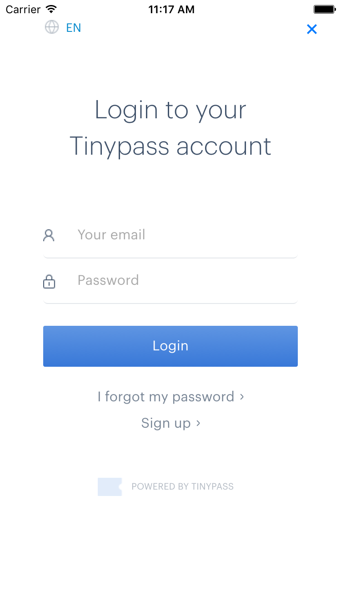
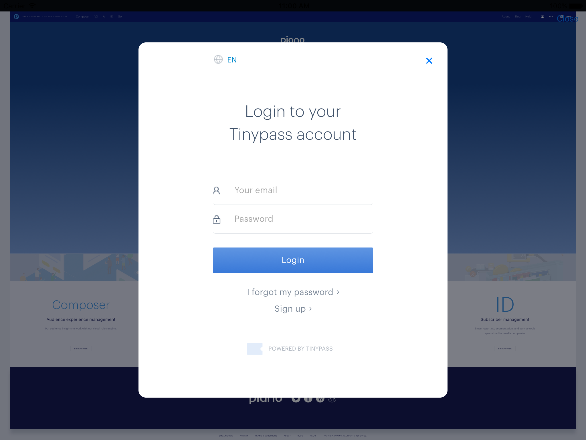
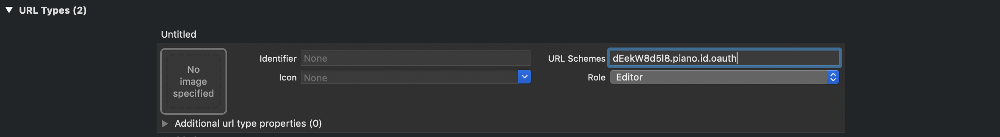

# Piano SDK for iOS
Piano SDK includes embedded dynamic frameworks written in Swift.

- **[PianoComposer](http://cocoapods.org/pods/PianoComposer):** provides access to the mobile composer

[](http://cocoapods.org/pods/PianoComposer)
[](http://cocoapods.org/pods/PianoComposer)
[](http://cocoapods.org/pods/PianoComposer)

- **[PianoOAuth](http://cocoapods.org/pods/PianoOAuth):** component for authentication with user providers Piano ID and Piano Accounts. Frameworks can be used for development iOS applications on Objective-c and Swift.

[](http://cocoapods.org/pods/PianoOAuth)
[](http://cocoapods.org/pods/PianoOAuth)
[](http://cocoapods.org/pods/PianoOAuth)

This document details the process of integrating the Piano SDK with your iOS application. If you have any questions, don't hesitate to email us at support@piano.io.

## Requirements
- iOS 8.0+
- Xcode 11.3
- Swift 5.1

## Installation

### [CocoaPods](https://cocoapods.org/)

Add the following lines to your `Podfile`.

```
use_frameworks!

pod 'PianoComposer', '~>2.3.7'
pod 'PianoOAuth', '~>2.3.7'
```

Then run `pod install`. For details of the installation and usage of CocoaPods, visit [official web site](https://cocoapods.org/).


## PianoComposer Usage

##### Imports
```swift
// swift
import PianoComposer
```
```
// objective-c
@import PianoComposer;
```

##### Usage
```swift
var composer = PianoComposer(aid: "<PUBLISHER_AID>")
.delegate(self) // conform PianoComposerDelegate protocol
.tag("tag1") // add single tag
.tag("tag2") // add single tag
.tags(["tag3", "tag4"]) //add array of tags
.zoneId("Zone1") // set zone
.referrer("http://sitename.com") // set referrer
.url("http://pubsite.com/page1") // set url
.customVariable(name: "customId", value: "1") // set custom variable
.userToken("userToken") // set user token
```

##### Switch to sandbox
```swift
let composer = PianoComposer(aid: "<PUBLISHER_AID>", sandbox: true)
// or
let composer = PianoComposer(aid: "<PUBLISHER_AID>", endpointUrl: PianoComposer.sandboxEndpointUrl)
// or
let composer = PianoComposer(aid: "<PUBLISHER_AID>")
composer.endpointUrl(endpointUrl: PianoComposer.sandboxEndpointUrl)
```

##### Composer execution
```swift 
composer.execute()
``` 

##### PianoComposerDelegate protocol
```swift
// Client actions
optional func composerExecutionCompleted(composer: PianoComposer)

// Composer actions from server 
optional func showLogin(composer: PianoComposer, event: XpEvent, params: ShowLoginEventParams?)
optional func showTemplate(composer: PianoComposer, event: XpEvent, params: ShowTemplateEventParams?)
optional func nonSite(composer: PianoComposer, event: XpEvent)
optional func userSegmentTrue(composer: PianoComposer, event: XpEvent)
optional func userSegmentFalse(composer: PianoComposer, event: XpEvent)    
optional func meterActive(composer: PianoComposer, event: XpEvent, params: PageViewMeterEventParams?)
optional func meterExpired(composer: PianoComposer, event: XpEvent, params: PageViewMeterEventParams?)    
optional func experienceExecute(composer: PianoComposer, event: XpEvent, params: ExperienceExecuteEventParams?)
```


##### PianoOAuthDelegate protocol
```swift
func loginSucceeded(accessToken: String)
func loginCancelled() 
```


## PianoOAuth Usage

#### Imports
```swift
// swift
import PianoOAuth
```
```
// objective-c
@import PianoOAuth;

```

#### Piano accounts user provider
##### Usage
```swift
let vc = PianoOAuthPopupViewController(aid: "<PUBLISHER_AID>") // for piano accounts user provider
...
vc.delegate = someDelegate // conform PianoOAuthDelegate protocol
vc.signUpEnabled = true // makes "sign up" button enabled (default: false)
vc.widgetType = .login // widget type (possible values: ".login", ".register")
vc.showPopup()
```
##### PianoOAuthDelegate protocol
```swift
func loginSucceeded(accessToken: String)
func loginCancelled() 
```

##### Screenshots




#### Piano ID user provider
##### Piano ID only

Usage similar as Piano accounts
```swift
let vc = PianoIdOAuthPopupViewController(aid: "<PUBLISHER_AID>")
...
vc.delegate = someDelegate // conform PianoOAuthDelegate protocol
vc.signUpEnabled = true // makes "sign up" button enabled (default: false)
vc.widgetType = .login // widget type (possible values: ".login", ".register")
vc.showPopup()
```

##### Piano ID with social sign in
PianoID requires a custom URL Scheme to be added to your project. To add: open your project configuration select your app from the TARGETS section, then select the Info tab, and expand the URL Types section. 

Set ```piano.id.oauth.<PUBLISHER_AID>```
as URL schemes. For example:


To enable social sign in, you must configure the PianoID shared instance before usage.

```swift
PianoID.shared.aid = "<PUBLISHER_AID>"
PianoID.shared.delegate = self
```

Also you must implement the ```application(_:open:options:)``` method of your app delegate and call ```handleUrl``` method of ```PianoID``` instance
```swift
func application(_ app: UIApplication, open url: URL, options: [UIApplicationOpenURLOptionsKey : Any] = [:]) -> Bool {
    return PianoID.shared.handleUrl(url, options: options)
}
```
For iOS 8 and older  you must implement the  deprecated ```application(_:open:sourceApplication:annotation:)``` method of your app delegate and call ```handleUrl``` method of ```PianoID``` instance
```swift
func application(_ application: UIApplication, open url: URL, sourceApplication: String?, annotation: Any) -> Bool {
    return PianoID.shared.handleUrl(url, sourceApp: sourceApplication, annotation: annotation)
}
```


To sign in:
```swift
PianoID.shared.signIn()
```

To sign out:
```swift
PianoID.shared.signOut(token: "<TOKEN>")
```

Additional settings:
```swift
PianoID.shared.isSandbox = true // for using sandbox application
PianoID.shared.widgetType = .login // or .register for choosing default screen 
PianoID.shared.signUpEnabled = false // for enabling/disabling signUp
```


##### PianoIDDelegate protocol
```swift
optional func pianoID(_ pianoID: PianoID, didSignInWithToken token: String!, withError error: Error!) // when sign in complete
optional func pianoID(_ pianoID: PianoID, didSignOutForToken token: String, withError error: Error!) // when sign out complete 
optional func pianoIDSignInDidCancel(_ pianoID: PianoID) // when user cancel sign in
```


##### Show templates
We recommend to use that tag in mobile templates for correct display on iOS devices
```html
<meta name="viewport" content="width=device-width, initial-scale=1">
```
